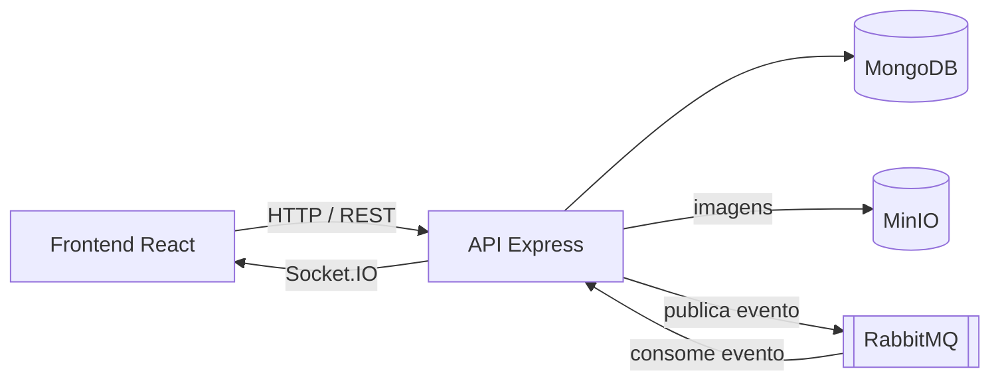

# Social Network

Rede social fullstack com perfis, posts com imagem, curtidas, comentários, seguidores e notificações em tempo real.

## Funcionalidades

- Cadastro e login com JWT
- Perfis com busca por texto, seguir e deixar de seguir
- Posts com upload de imagem, edição e exclusão
- Curtidas e comentários em posts, e curtidas em comentários
- Feed com os seus posts e os de quem você segue, do mais recente para o mais antigo, com rolagem infinita
- Notificações em tempo real quando alguém que você segue publica, ou quando interagem com seus posts e comentários

## Arquitetura



1. A API grava o post, o comentário ou a curtida no MongoDB.
2. Em seguida, publica um evento no RabbitMQ com o tipo da ação e os perfis que devem ser avisados.
3. Um consumidor na própria API recebe o evento e envia a notificação, via Socket.IO, só para os usuários conectados que estão na lista.

A fila separa a ação do usuário do envio das notificações: quem publica não precisa saber quem está conectado, e o consumidor pode ser escalado de forma independente.

## Destaques técnicos

- **Mensageria com RabbitMQ** (biblioteca `rascal`) para desacoplar as ações das notificações
- **WebSocket autenticado**: a conexão do Socket.IO valida o mesmo JWT da API REST
- **Upload de imagens para o MinIO** com o SDK S3 da AWS, então o mesmo código funcionaria no Amazon S3
- **Documentação da API com Swagger**, gerada a partir dos comentários das rotas
- **Paginação no feed**, consumida no frontend com rolagem infinita
- **Ambiente completo com Docker Compose**: API, frontend, MongoDB, RabbitMQ e MinIO sobem juntos

## Stack

**Backend:** Node.js, Express, MongoDB (Mongoose), RabbitMQ, Socket.IO, MinIO, JWT e Swagger

**Frontend:** React, TypeScript, MUI, React Router, Axios e Socket.IO Client

**Infra:** Docker e Docker Compose

## Como rodar

Pré-requisitos: Docker e Docker Compose.

1. Clone o repositório:

   ```bash
   git clone https://github.com/igorttosta/Social-Network.git
   cd Social-Network
   ```

2. No `docker-compose.yml`, troque os IPs do MinIO pelo IP da sua máquina na rede local, para que o navegador consiga carregar as imagens:
   - `BUCKET_HOST` no serviço `api`
   - o endereço do comando `mc config host add` no serviço `mc`

3. Suba o ambiente:

   ```bash
   docker compose up --build
   ```

| Serviço | Endereço |
|---|---|
| Frontend | http://localhost:3000 |
| API | http://localhost:4000/v1 |
| Documentação da API (Swagger) | http://localhost:4000/api-docs |
| Painel do RabbitMQ | http://localhost:15672 |
| Console do MinIO | http://localhost:9001 |

## Principais rotas da API

| Recurso | Rotas |
|---|---|
| Autenticação | `POST /security/register`, `POST /security/login` |
| Usuário | `GET`, `PUT` e `DELETE /users/me` |
| Perfis | `GET /profiles`, `GET /profiles/search?q=`, `GET /profiles/:id`, `POST /profiles/:id/follow` e `/unfollow` |
| Posts | `GET` e `POST /posts`, `GET`, `PUT` e `DELETE /posts/:id`, `POST /posts/:id/like` e `/unlike` |
| Comentários | `GET` e `POST /posts/:postId/comments`, `PUT` e `DELETE /posts/:postId/comments/:id`, curtir e descurtir |
| Feed | `GET /feed?page=` |

A lista completa, com os formatos de entrada e saída, está no Swagger.

## Estrutura

```
api/
  routers/     Rotas REST (segurança, usuários, perfis, posts, comentários, feed)
  model/       Schemas do Mongoose
  lib/         Publicação e consumo no RabbitMQ, upload para o MinIO
  index.js     Servidor HTTP, Socket.IO e consumidor de eventos
frontend/
  src/pages/       Telas (feed, perfil, perfis, novo post, detalhes, login e cadastro)
  src/components/  Componentes reutilizáveis
docker-compose.yml
```

## Autor

Feito por **Igor Tosta** · [LinkedIn](https://www.linkedin.com/in/matos-igor-tosta/) · [GitHub](https://github.com/igorttosta)
